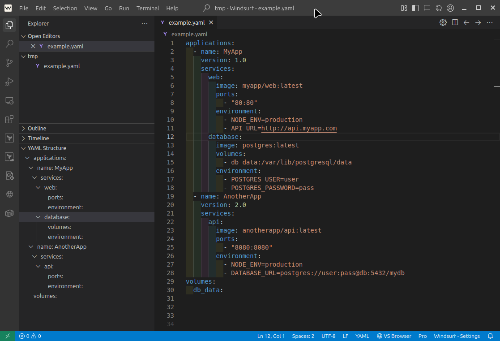

# YAML Tree Viewer

Visualize your YAML files as a collapsible tree in the sidebar. This extension lets you easily explore the structure of complex YAML documents, focusing only on meaningful, expandable branches.

## Features

- Displays YAML structure as a tree in the VS Code/Windsurf sidebar
- Only shows expandable branches (maps and sequences with children)
- Clicking a tree item navigates to the corresponding line in the YAML file
- Clean, minimal tree view—no clutter from simple key-value pairs
- Works with any YAML file

## Usage

1. Open any `.yaml` or `.yml` file
2. Open the "YAML Structure" view in the Explorer sidebar
3. Expand/collapse nodes to explore your YAML's structure
4. Click a node to jump to its location in the file

## Extension Settings

No settings required—just install and use!

## Requirements

- VS Code 1.85.0+ or compatible environment

## Development

- Clone the repo
- Run `npm install`
- Run `npm run compile`
- Launch the extension

## License

GPL-3.0-or-later

---

This code was generated with Windsurf and GPT-4.1 by providing examples of the input and output needed, and iteratively refining the code until it met the requirements.
